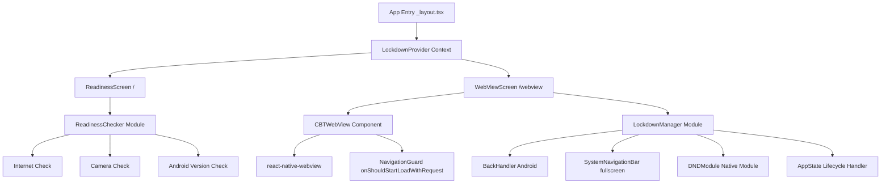
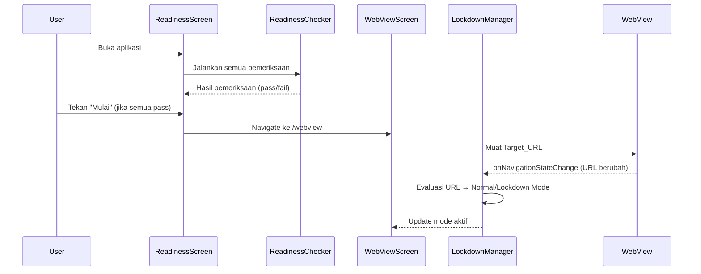
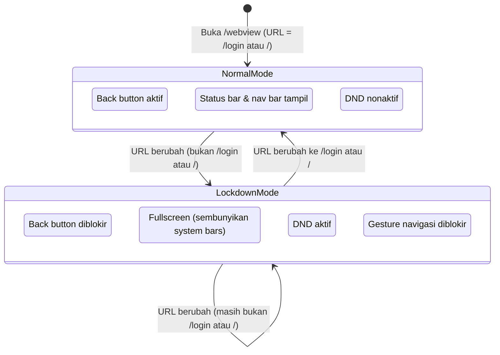

# Design Document: CBT App Mobile

## Overview

CBT App Mobile adalah aplikasi Android berbasis React Native (Expo) yang berfungsi sebagai dedicated client untuk platform ujian online di `https://cbt.mtssupel.sch.id`. Aplikasi ini memiliki dua tanggung jawab utama:

1. **Pengecekan kesiapan perangkat** — memverifikasi koneksi internet, ketersediaan kamera, dan versi Android sebelum peserta masuk ke WebView.
2. **Lockdown browser** — menampilkan platform CBT dalam WebView dengan mode lockdown yang memblokir semua navigasi sistem, notifikasi, dan akses ke domain eksternal saat peserta sedang mengerjakan ujian.

### Keputusan Desain Utama

- **Expo Managed Workflow dengan Config Plugin** — Proyek menggunakan Expo managed workflow. Fitur-fitur native (DND, gesture blocking, fullscreen) memerlukan native module atau config plugin. Untuk fitur yang tidak tersedia di Expo SDK standar, akan digunakan `expo-modules-core` atau native module melalui bare workflow / development build.
- **expo-router** — Navigasi antar layar menggunakan expo-router (sudah ada di proyek). Readiness Screen menjadi route default (`/`), WebView Screen menjadi route `/webview`.
- **react-native-webview** — Library WebView yang paling matang untuk React Native, mendukung `onNavigationStateChange`, `onShouldStartLoadWithRequest`, dan camera permission.
- **State Management Lokal** — Tidak memerlukan state management global (Redux/Zustand). State lockdown dikelola melalui React Context agar dapat diakses dari komponen manapun.
- **Native Android Module untuk DND** — Do Not Disturb API adalah Android-only API yang tidak tersedia di Expo SDK. Akan dibuat native module sederhana menggunakan `expo-modules-core`.

---

## Architecture

### Diagram Arsitektur



### Alur Navigasi



### Alur Mode Lockdown



---

## Components and Interfaces

### 1. LockdownContext

Context React yang menyimpan dan mendistribusikan status lockdown ke seluruh aplikasi.

```typescript
// context/LockdownContext.tsx
interface LockdownContextValue {
  isLockdownActive: boolean;
  setLockdownActive: (active: boolean) => void;
}
```

### 2. ReadinessChecker Module

Modul utilitas murni (pure functions) yang melakukan pemeriksaan kondisi perangkat.

```typescript
// modules/readiness-checker.ts
interface CheckResult {
  passed: boolean;
  message: string;
}

interface ReadinessCheckResults {
  internet: CheckResult;
  camera: CheckResult;
  androidVersion: CheckResult;
}

// Fungsi-fungsi pemeriksaan
async function checkInternet(): Promise<CheckResult>
async function checkCamera(): Promise<CheckResult>
function checkAndroidVersion(): CheckResult
async function runAllChecks(): Promise<ReadinessCheckResults>
```

**Implementasi pemeriksaan:**
- **Internet**: Menggunakan `@react-native-community/netinfo` atau `fetch` ke endpoint kecil untuk memverifikasi konektivitas aktif.
- **Kamera**: Menggunakan `expo-camera` (`Camera.requestCameraPermissionsAsync()` / `Camera.getCameraPermissionsAsync()`) untuk memeriksa ketersediaan dan izin kamera.
- **Android Version**: Menggunakan `Platform.Version` (React Native) yang mengembalikan API Level. Android 8.0 = API Level 26.

### 3. ReadinessScreen Component

Layar pertama yang ditampilkan saat aplikasi dibuka.

```typescript
// app/index.tsx
interface CheckItemProps {
  label: string;
  result: CheckResult | null; // null = sedang memeriksa
}
```

**Elemen UI:**
- Header dengan nama aplikasi dan logo sekolah
- Daftar item pemeriksaan (`CheckItem`) dengan indikator visual (✓ hijau / ✗ merah / spinner)
- Tombol "Mulai" — aktif hanya jika semua pemeriksaan lulus
- Tombol "Periksa Ulang" untuk menjalankan ulang pemeriksaan

### 4. CBTWebView Component

Komponen WebView yang membungkus `react-native-webview` dengan konfigurasi khusus.

```typescript
// components/CBTWebView.tsx
interface CBTWebViewProps {
  onUrlChange: (url: string) => void;
  onLoadError: () => void;
}
```

**Konfigurasi WebView:**
- `source={{ uri: TARGET_URL }}`
- `javaScriptEnabled={true}`
- `domStorageEnabled={true}` — untuk mempertahankan sesi login
- `scalesPageToFit={false}` + `textZoom={100}` — menonaktifkan zoom
- `mediaPlaybackRequiresUserAction={false}`
- `allowsInlineMediaPlayback={true}`
- `onShouldStartLoadWithRequest` — untuk memblokir domain eksternal
- `onNavigationStateChange` — untuk mendeteksi perubahan URL
- `onError` / `onHttpError` — untuk menangani error loading

### 5. LockdownManager Module

Modul yang mengelola semua aspek lockdown berdasarkan status mode aktif.

```typescript
// modules/lockdown-manager.ts
interface LockdownManagerOptions {
  onBackBlocked?: () => void; // callback saat back diblokir
}

function activateLockdown(options?: LockdownManagerOptions): void
function deactivateLockdown(): void
function isUrlLocked(url: string): boolean // true jika URL bukan /login atau /
```

**Sub-komponen LockdownManager:**

| Sub-komponen | Tanggung Jawab | Implementasi |
|---|---|---|
| BackHandler | Blokir tombol Back Android | `BackHandler.addEventListener('hardwareBackPress', ...)` |
| SystemNavigationBar | Fullscreen / sembunyikan system bars | `expo-navigation-bar` + `expo-status-bar` |
| DNDModule | Aktifkan/nonaktifkan Do Not Disturb | Native module (Android `NotificationManager`) |
| AppStateHandler | Deteksi app masuk background | `AppState.addEventListener('change', ...)` |

### 6. DNDModule (Native Module)

Native module Android untuk mengakses `NotificationManager.setInterruptionFilter()`.

```typescript
// modules/dnd/index.ts
interface DNDModule {
  isPermissionGranted(): Promise<boolean>;
  requestPermission(): Promise<void>; // membuka Settings DND
  enableDND(): Promise<void>;
  disableDND(): Promise<void>;
}
```

**Android API yang digunakan:**
- `NotificationManager.isNotificationPolicyAccessGranted()` — cek izin
- `Intent(Settings.ACTION_NOTIFICATION_POLICY_ACCESS_SETTINGS)` — minta izin
- `NotificationManager.setInterruptionFilter(INTERRUPTION_FILTER_NONE)` — aktifkan DND
- `NotificationManager.setInterruptionFilter(INTERRUPTION_FILTER_ALL)` — nonaktifkan DND

### 7. WebViewScreen Component

Layar utama yang mengintegrasikan CBTWebView dan LockdownManager.

```typescript
// app/webview.tsx
```

**Tanggung Jawab:**
- Merender `CBTWebView`
- Mendengarkan perubahan URL dari WebView
- Memanggil `LockdownManager.activateLockdown()` / `deactivateLockdown()` berdasarkan URL
- Menampilkan loading indicator dan error state
- Menangani peringatan saat app masuk background dalam Lockdown Mode

---

## Data Models

### AppConfig

Konstanta konfigurasi aplikasi yang terpusat.

```typescript
// constants/config.ts
export const APP_CONFIG = {
  TARGET_URL: 'https://cbt.mtssupel.sch.id',
  TARGET_DOMAIN: 'cbt.mtssupel.sch.id',
  LOGIN_PATHS: ['/login', '/'],
  ANDROID_MIN_API_LEVEL: 26, // Android 8.0
  ANDROID_MIN_VERSION_LABEL: 'Android 8.0',
} as const;
```

### CheckResult

```typescript
interface CheckResult {
  passed: boolean;
  message: string; // pesan yang ditampilkan ke pengguna
}
```

### ReadinessCheckResults

```typescript
interface ReadinessCheckResults {
  internet: CheckResult;
  camera: CheckResult;
  androidVersion: CheckResult;
}

// Helper
function allChecksPassed(results: ReadinessCheckResults): boolean {
  return results.internet.passed && results.camera.passed && results.androidVersion.passed;
}
```

### LockdownState

```typescript
type AppMode = 'normal' | 'lockdown';

interface LockdownState {
  mode: AppMode;
  dndPermissionGranted: boolean;
  dndPermissionRequested: boolean;
}
```

### NavigationGuardResult

```typescript
interface NavigationGuardResult {
  allowed: boolean;
  reason?: 'external_domain' | 'allowed';
}

function evaluateNavigation(url: string, targetDomain: string): NavigationGuardResult
```

---

## Correctness Properties


*A property is a characteristic or behavior that should hold true across all valid executions of a system — essentially, a formal statement about what the system should do. Properties serve as the bridge between human-readable specifications and machine-verifiable correctness guarantees.*

### Property 1: Android Version Check adalah Fungsi Murni

*For any* nilai API level Android, `checkAndroidVersion()` SHALL mengembalikan `passed=true` jika dan hanya jika API level >= 26 (Android 8.0), dan `passed=false` untuk semua nilai di bawah 26.

**Validates: Requirements 1.4**

### Property 2: Tombol "Mulai" Aktif Hanya Jika Semua Pemeriksaan Lulus

*For any* kombinasi hasil pemeriksaan (internet, kamera, versi Android), `allChecksPassed(results)` SHALL mengembalikan `true` jika dan hanya jika ketiga pemeriksaan memiliki `passed=true`. Jika satu atau lebih pemeriksaan memiliki `passed=false`, fungsi SHALL mengembalikan `false`.

**Validates: Requirements 1.5, 1.6**

### Property 3: Evaluasi URL Lockdown adalah Konsisten dan Deterministik

*For any* URL string, `isUrlLocked(url)` SHALL mengembalikan `false` jika URL mengandung path `/login` atau merupakan root path `/`, dan SHALL mengembalikan `true` untuk semua URL lainnya. Memanggil fungsi ini berkali-kali dengan URL yang sama SHALL selalu menghasilkan nilai yang sama (idempoten).

**Validates: Requirements 3.1, 3.2, 3.3, 3.4**

### Property 4: Back Button Behavior Konsisten dengan Mode Aktif

*For any* mode aktif (Normal atau Lockdown), perilaku tombol Back Android SHALL konsisten: saat Lockdown_Mode aktif, setiap back press event SHALL diblokir (handler mengembalikan `true`); saat Normal_Mode aktif, back press event SHALL diteruskan (handler mengembalikan `false`).

**Validates: Requirements 4.1, 4.6**

### Property 5: Navigation Guard Memblokir Semua Domain Eksternal

*For any* URL yang dicoba dimuat oleh WebView, `evaluateNavigation(url, targetDomain)` SHALL mengembalikan `allowed=true` jika dan hanya jika domain URL adalah `cbt.mtssupel.sch.id` (termasuk semua path di bawahnya). Untuk semua URL dengan domain berbeda, fungsi SHALL mengembalikan `allowed=false`.

**Validates: Requirements 6.1, 6.3**

### Property 6: DND Diaktifkan Hanya Saat Izin Diberikan dan Lockdown Aktif

*For any* kondisi izin DND (granted/denied), saat Lockdown_Mode diaktifkan: jika izin DND `granted`, maka `DNDModule.enableDND()` SHALL dipanggil; jika izin DND `denied`, maka `DNDModule.enableDND()` SHALL tidak dipanggil dan peringatan SHALL ditampilkan.

**Validates: Requirements 5.2, 5.4**

### Property 7: Lockdown-Unlock Round Trip Menonaktifkan DND

*For any* sesi lockdown di mana DND berhasil diaktifkan, ketika Lockdown_Mode dinonaktifkan (URL berubah ke `/login` atau `/`), `DNDModule.disableDND()` SHALL dipanggil untuk mengembalikan pengaturan notifikasi ke kondisi semula.

**Validates: Requirements 5.3**

### Property 8: Peringatan Background Konsisten dengan Mode Aktif

*For any* perubahan AppState ke `'background'`, perilaku aplikasi SHALL konsisten dengan mode aktif: saat Lockdown_Mode aktif, peringatan SHALL ditampilkan; saat Normal_Mode aktif, tidak ada peringatan yang ditampilkan.

**Validates: Requirements 7.1, 7.3**

### Property 9: Lockdown State Dipertahankan Setelah Background-Foreground Transition

*For any* sesi Lockdown_Mode aktif, ketika aplikasi berpindah ke background kemudian kembali ke foreground, semua mekanisme pemblokiran (BackHandler, fullscreen, DND) SHALL kembali aktif dan mode SHALL tetap Lockdown_Mode.

**Validates: Requirements 7.2**

---

## Error Handling

### Strategi Penanganan Error

| Skenario Error | Komponen | Penanganan |
|---|---|---|
| Koneksi internet tidak tersedia saat Readiness Check | ReadinessChecker | Tampilkan pesan "Koneksi internet tidak tersedia", tombol "Mulai" dinonaktifkan |
| Kamera tidak tersedia / izin ditolak | ReadinessChecker | Tampilkan pesan "Kamera tidak tersedia", tombol "Mulai" dinonaktifkan |
| Versi Android di bawah minimum | ReadinessChecker | Tampilkan pesan "Versi Android tidak didukung (minimum Android 8.0)", tombol "Mulai" dinonaktifkan |
| Target_URL gagal dimuat (network error) | CBTWebView | Tampilkan error screen dengan tombol "Coba Lagi" yang memanggil `webViewRef.current?.reload()` |
| Target_URL gagal dimuat (HTTP error) | CBTWebView | Tampilkan error screen dengan kode HTTP dan tombol "Coba Lagi" |
| Navigasi ke URL eksternal diblokir | CBTWebView | Tampilkan pesan "Akses ke situs eksternal tidak diizinkan selama ujian" (Toast atau inline message) |
| Izin DND ditolak pengguna | LockdownManager | Lanjutkan dengan pemblokiran navigasi aktif, tampilkan peringatan bahwa notifikasi tidak dapat diblokir sepenuhnya |
| App masuk background saat Lockdown_Mode | AppStateHandler | Tampilkan peringatan modal "Anda tidak diizinkan meninggalkan aplikasi selama ujian" |
| Native module DND tidak tersedia | DNDModule | Graceful degradation — log error, tampilkan peringatan, lanjutkan tanpa DND |

### Error Boundaries

- Setiap pemeriksaan di `ReadinessChecker` dibungkus dalam `try-catch` — kegagalan satu pemeriksaan tidak menghentikan pemeriksaan lainnya.
- `CBTWebView` menggunakan `onError` dan `onHttpError` dari `react-native-webview` untuk menangkap semua jenis kegagalan loading.
- `DNDModule` menggunakan `try-catch` di setiap operasi native — kegagalan DND tidak menghentikan lockdown navigasi.

---

## Testing Strategy

### Pendekatan Pengujian Ganda

Fitur ini menggunakan dua pendekatan pengujian yang saling melengkapi:

1. **Unit Tests** — Menguji contoh spesifik, edge case, dan kondisi error
2. **Property-Based Tests** — Menguji properti universal di seluruh ruang input

### Library yang Digunakan

- **Test Runner**: Jest (sudah terintegrasi dengan Expo)
- **Property-Based Testing**: `fast-check` — library PBT yang matang untuk JavaScript/TypeScript
- **React Native Testing**: `@testing-library/react-native`
- **Mock**: Jest built-in mocks untuk native modules

### Konfigurasi Property-Based Tests

Setiap property test dikonfigurasi dengan minimum **100 iterasi** menggunakan `fast-check`:

```typescript
import fc from 'fast-check';

// Contoh konfigurasi
fc.assert(
  fc.property(fc.integer(), (apiLevel) => {
    // ... properti
  }),
  { numRuns: 100 }
);
```

Tag format untuk setiap property test:
```
// Feature: cbt-app, Property {N}: {property_text}
```

### Unit Tests

**ReadinessChecker:**
- Test bahwa `checkInternet()` mengembalikan `passed=false` saat tidak ada koneksi
- Test bahwa `checkCamera()` mengembalikan `passed=false` saat izin ditolak
- Test navigasi ke `/webview` saat tombol "Mulai" ditekan
- Test tampilan loading indicator saat WebView memuat
- Test tampilan error screen saat WebView gagal memuat
- Test pesan peringatan saat app masuk background dalam Lockdown_Mode

**CBTWebView:**
- Test bahwa WebView dirender dengan `source.uri = TARGET_URL`
- Test bahwa `domStorageEnabled=true` (sesi login dipertahankan)
- Test bahwa `scalesPageToFit=false` (zoom dinonaktifkan)
- Test tampilan pesan saat URL eksternal diblokir

**LockdownManager:**
- Test bahwa `activateLockdown()` memanggil `BackHandler.addEventListener`
- Test bahwa `deactivateLockdown()` memanggil `BackHandler.removeEventListener`
- Test bahwa system bars disembunyikan saat lockdown aktif
- Test bahwa system bars ditampilkan saat mode normal

### Property-Based Tests

Setiap properti dari bagian Correctness Properties diimplementasikan sebagai satu property-based test:

**Property 1 — Android Version Check:**
```typescript
// Feature: cbt-app, Property 1: Android version check adalah fungsi murni
fc.assert(
  fc.property(fc.integer({ min: 1, max: 50 }), (apiLevel) => {
    const result = checkAndroidVersion(apiLevel);
    return apiLevel >= 26 ? result.passed === true : result.passed === false;
  }),
  { numRuns: 100 }
);
```

**Property 2 — allChecksPassed:**
```typescript
// Feature: cbt-app, Property 2: Tombol Mulai aktif hanya jika semua pemeriksaan lulus
fc.assert(
  fc.property(
    fc.record({
      internet: fc.record({ passed: fc.boolean(), message: fc.string() }),
      camera: fc.record({ passed: fc.boolean(), message: fc.string() }),
      androidVersion: fc.record({ passed: fc.boolean(), message: fc.string() }),
    }),
    (results) => {
      const expected = results.internet.passed && results.camera.passed && results.androidVersion.passed;
      return allChecksPassed(results) === expected;
    }
  ),
  { numRuns: 100 }
);
```

**Property 3 — isUrlLocked:**
```typescript
// Feature: cbt-app, Property 3: Evaluasi URL lockdown adalah konsisten dan deterministik
fc.assert(
  fc.property(fc.webUrl(), (url) => {
    const result1 = isUrlLocked(url);
    const result2 = isUrlLocked(url); // idempoten
    return result1 === result2;
  }),
  { numRuns: 100 }
);
```

**Property 4 — Back Button:**
```typescript
// Feature: cbt-app, Property 4: Back button behavior konsisten dengan mode aktif
// Ditest dengan mock BackHandler dan berbagai mode state
```

**Property 5 — Navigation Guard:**
```typescript
// Feature: cbt-app, Property 5: Navigation guard memblokir semua domain eksternal
fc.assert(
  fc.property(fc.webUrl(), (url) => {
    const result = evaluateNavigation(url, 'cbt.mtssupel.sch.id');
    const urlDomain = new URL(url).hostname;
    const isTargetDomain = urlDomain === 'cbt.mtssupel.sch.id';
    return result.allowed === isTargetDomain;
  }),
  { numRuns: 100 }
);
```

**Property 6 — DND Activation:**
```typescript
// Feature: cbt-app, Property 6: DND diaktifkan hanya saat izin diberikan dan lockdown aktif
// Ditest dengan mock DNDModule dan berbagai kondisi izin
```

**Property 7 — DND Round Trip:**
```typescript
// Feature: cbt-app, Property 7: Lockdown-unlock round trip menonaktifkan DND
// Ditest dengan mock DNDModule — aktifkan lockdown, nonaktifkan, verifikasi disableDND dipanggil
```

**Property 8 — Background Warning:**
```typescript
// Feature: cbt-app, Property 8: Peringatan background konsisten dengan mode aktif
// Ditest dengan mock AppState dan berbagai mode state
```

**Property 9 — Lockdown State After Transition:**
```typescript
// Feature: cbt-app, Property 9: Lockdown state dipertahankan setelah background-foreground transition
// Ditest dengan mock AppState — simulasi background→foreground, verifikasi state
```

### Struktur Direktori Tests

```
__tests__/
  modules/
    readiness-checker.test.ts    # Unit + Property tests untuk ReadinessChecker
    lockdown-manager.test.ts     # Unit + Property tests untuk LockdownManager
    navigation-guard.test.ts     # Property tests untuk evaluateNavigation
  components/
    CBTWebView.test.tsx           # Unit tests untuk CBTWebView
    ReadinessScreen.test.tsx      # Unit tests untuk ReadinessScreen
  integration/
    lockdown-lifecycle.test.ts   # Integration tests untuk siklus hidup lockdown
```

### Dependensi Tambahan yang Diperlukan

Dependensi berikut perlu ditambahkan ke proyek:

```json
{
  "dependencies": {
    "react-native-webview": "^13.x",
    "@react-native-community/netinfo": "^11.x",
    "expo-camera": "~16.x",
    "expo-navigation-bar": "~4.x"
  },
  "devDependencies": {
    "fast-check": "^3.x",
    "@testing-library/react-native": "^12.x",
    "jest": "^29.x"
  }
}
```

> **Catatan**: `expo-navigation-bar` sudah tersedia di Expo SDK. `react-native-webview` dan `@react-native-community/netinfo` memerlukan development build (tidak tersedia di Expo Go). DNDModule memerlukan implementasi native module menggunakan `expo-modules-core`.
